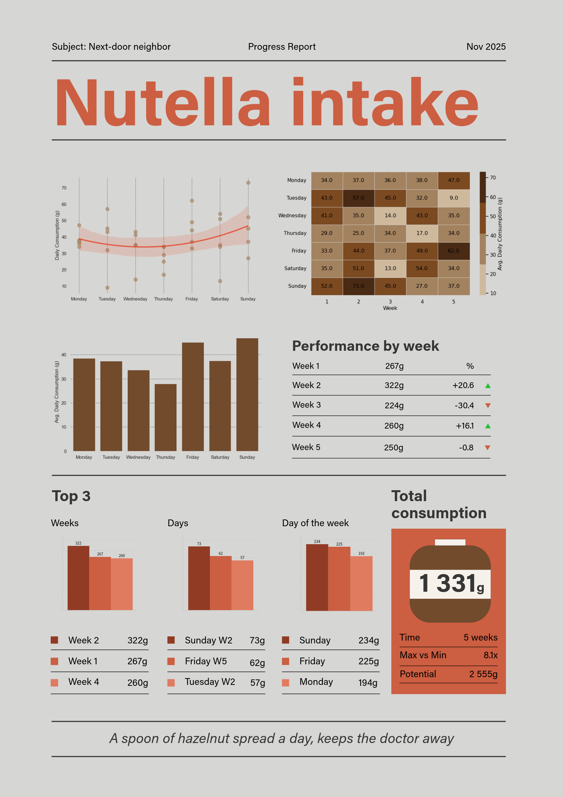

# Nutella Intake - A Data Study

A fun, real-world data project tracking one's daily Nutella consumption over 5-week period. 

## Background

My next-door neighbour loves Nutella. And I mean LOVES Nutella - every single morning each slice of bread is covered by a thin layer of dark spread. At some point it was impossible not to ask the obvious question: How much Nutella is actually going through that household?

I asked my subject to weigh the jar every day after brekky. The data was recorded by hand on paper, then transferred into Excel, analysed, and plotted. The result is a [poster](Nutella_poster_smaller.png):

Read the full PDF report [here](Full_report.pdf).

---

## Stats

| Metric | Value |
|---|---|
| Total consumption (5 weeks) | **1,331g** |
| Average daily consumption | **38g** |
| Peak week | Week 2 — 322g (+20.6%) |
| Lowest week | Week 3 — 224g (−30.4%) |
| Highest single day | Sunday, Week 2 — **73g** |
| Peak day of week | **Sunday** (234g total across all 5 Sundays) |
| Max vs Min daily ratio | **8.1×** |

## Analysis Overview

The notebook covered:

1. **Data loading & cleaning** — merging two Excel sheets, dropping jar-weight rows, type casting, annotating day-of-week and week number
2. **Exploratory analysis** — summary statistics, boxplots, scatter plots with mean lines
3. **Trend analysis** — linear regression on weekly averages, quadratic fit over day-of-week
4. **Distribution plots** — ridge plot (KDE by week), violin plot by day-of-week
5. **Heatmap** — consumption matrix (day × week)
6. **Weekly profiles** — multi-line chart comparing each week's daily pattern
7. **Fun facts** — how long to eat an elephant-weight jar, grams per minute, century supply estimate

## Tools

| Tool | Purpose |
|---|---|
| Python 3 | Core analysis |
| pandas, numpy | Data wrangling |
| matplotlib, seaborn | Visualisation |
| scikit-learn | Regression |
| openpyxl | Excel file reading |

## Lessons Learned

- Interesting data doesn't have to come from Kaggle. A kitchen scale and a notebook are enough.
- A spoon of hazelnut spread a day, keeps the doctor away. *(Not medical advice!)*
- The most compelling datasets are the ones with a story behind them.

---

*Made with Python and love for a hazelnut spread.*
